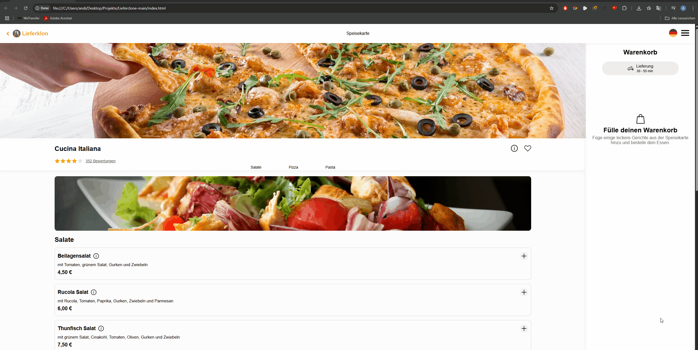

### Lieferclone

## Übersicht

Diese Anwendung ermöglicht es Nutzern, bequem Gerichte online auszuwählen und zu bestellen. Die App bietet eine benutzerfreundliche Oberfläche, die es einfach macht, Speisen auszuwählen, in den Warenkorb zu legen, die Menge anzupassen und Bestellungen abzuschließen.

## Funktionen
-  Gerichtsauswahl: Durch Klicken auf das +-Symbol können Gerichte der Bestellung hinzugefügt werden.
-  Warenkorbverwaltung: Im Warenkorb können die Mengen der ausgewählten Gerichte beliebig erhöht oder verringert werden. Es ist auch möglich, Gerichte vollständig aus dem Warenkorb zu entfernen.
-  Rechnungserstellung: Sobald mehrere Gerichte im Warenkorb sind, wird eine Rechnung erstellt, die den Gesamtbetrag anzeigt.
-  Bestellabschluss: Mit einem Klick auf Bestellen wird die Bestellung abgeschlossen und eine Bestätigung ausgegeben.

## Vorschau

